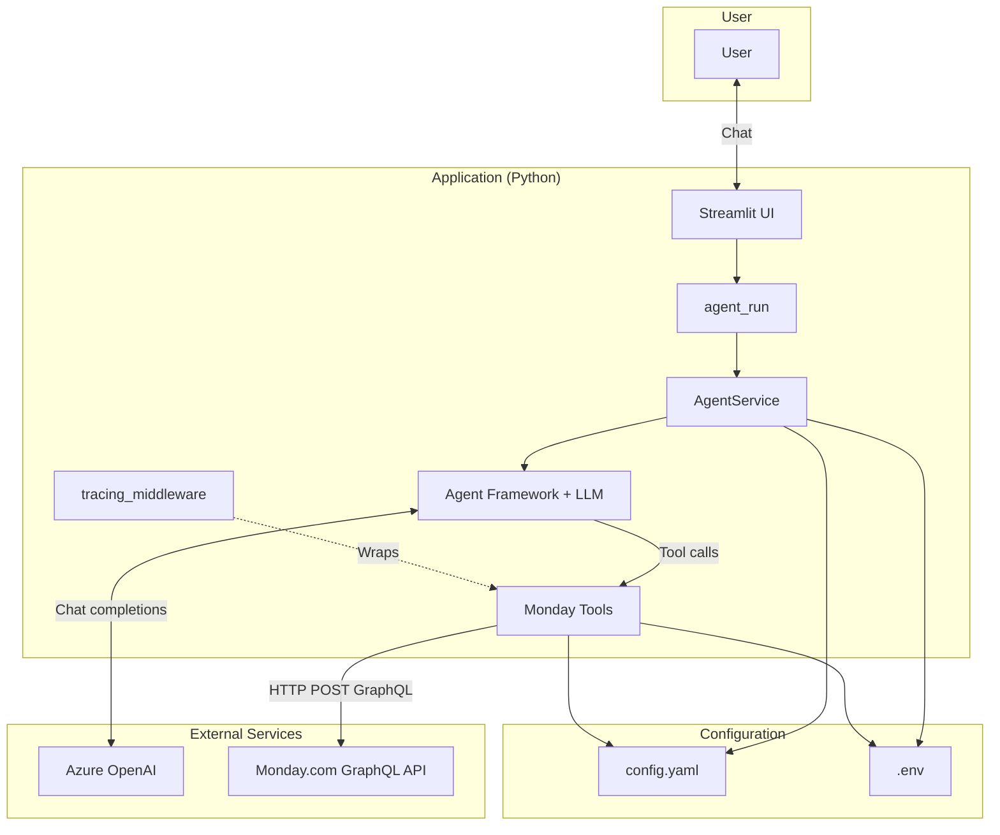
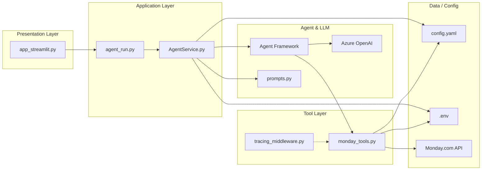
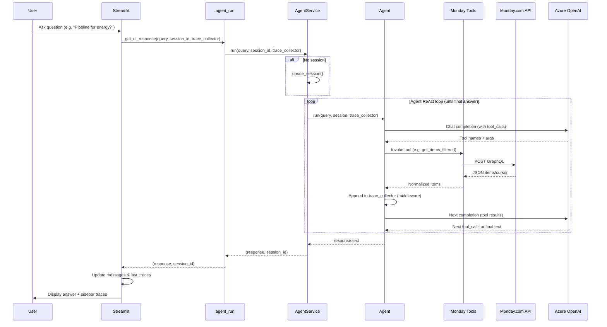
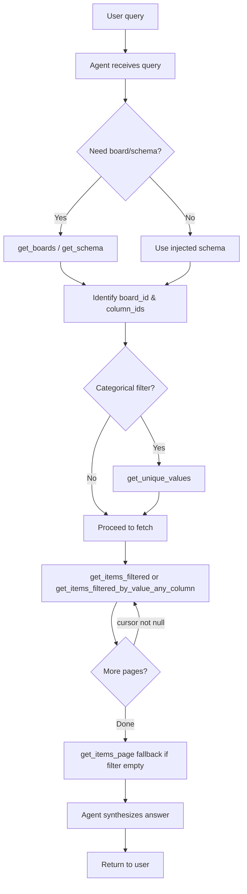
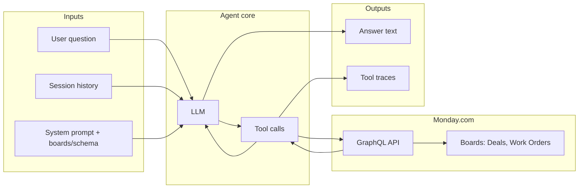
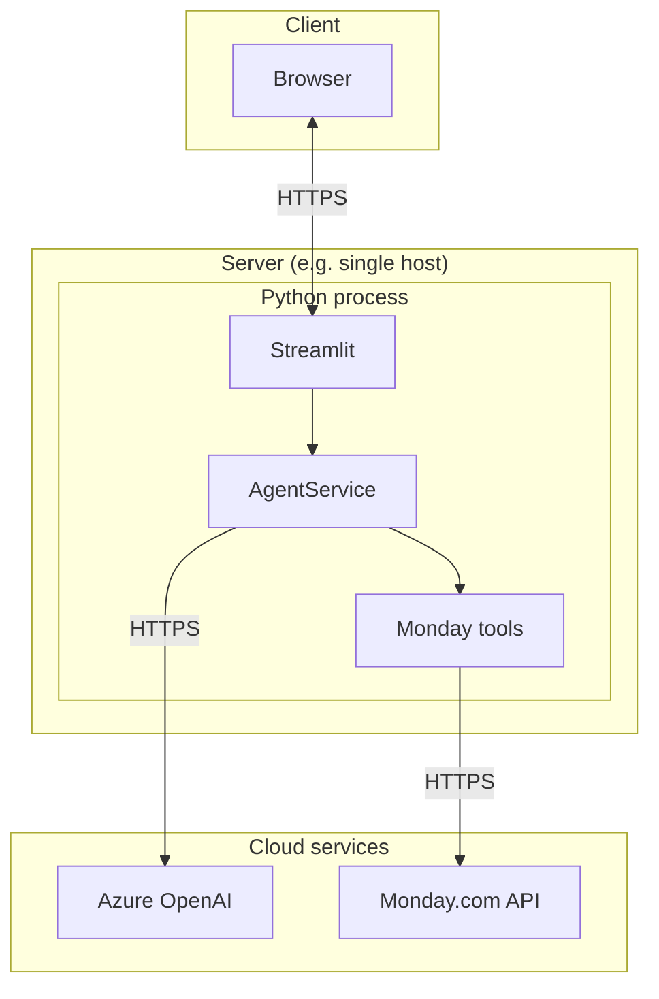
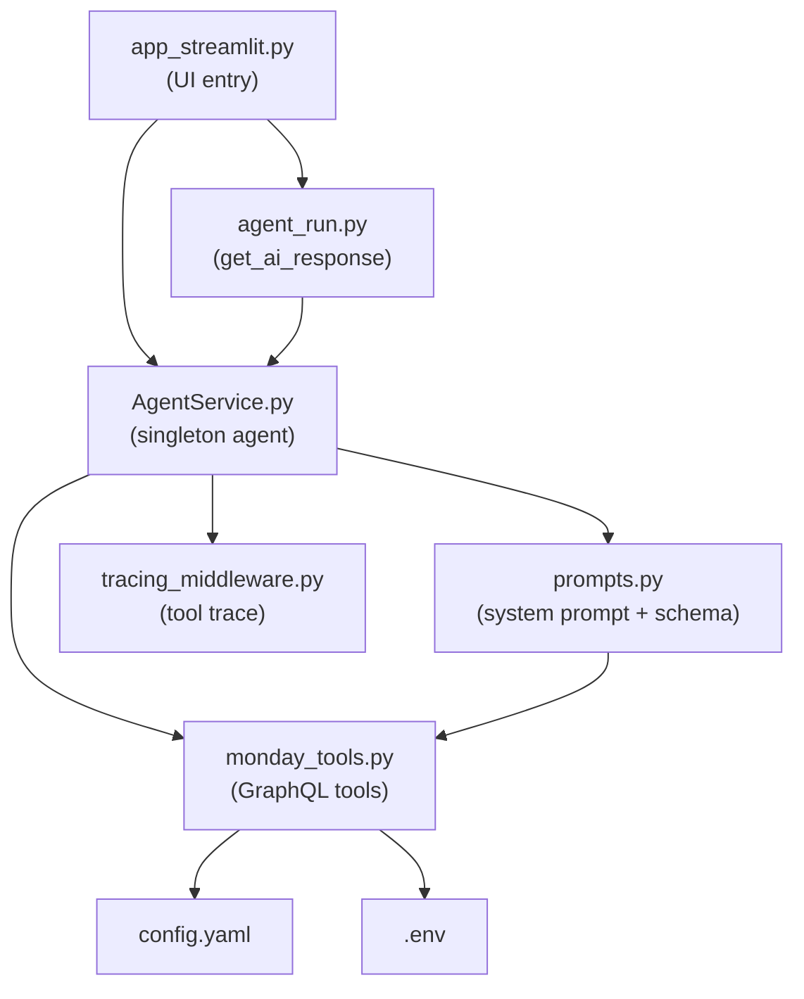

# Brief Architecture Overview — Monday.com BI Agent

This document describes the architecture of the Monday.com Business Intelligence Agent: high-level components, data flow, and query lifecycle. Diagrams use [Mermaid](https://mermaid.js.org/) and render in GitHub, VS Code (with a Mermaid extension), and many Markdown viewers.

---

## 1. High-Level Architecture

The system is a conversational BI agent: the user asks questions in natural language; the agent calls Monday.com via tools and uses an LLM to synthesize answers. All data is fetched at query time (no preload or cache).

---

## 2. Component Diagram

| Layer | Components | Responsibility |
|-------|-------------|----------------|
| **Presentation** | `app_streamlit.py` | Chat UI, session state, trace sidebar. |
| **Application** | `agent_run.py`, `AgentService.py` | Session creation, run/stream agent, inject trace_collector. |
| **Agent** | Agent Framework, Azure OpenAI, `prompts.py` | System prompt (boards/schema), tool-calling, multi-turn chat. |
| **Tools** | `monday_tools.py`, `tracing_middleware.py` | Monday.com GraphQL calls, normalization, trace recording. |
| **Data** | `config.yaml`, `.env`, Monday.com | Board IDs, API token, live board data. |

---

## 3. End-to-End Query Flow (Sequence)

This sequence shows what happens when a user sends one message.

---

## 4. Agent Tool-Call Flow (Detail)

The agent follows a ReAct-style workflow: reason about the query, call tools, then synthesize. This diagram shows the decision flow and tool usage.

---

## 5. Data Flow Overview

- **Inputs:** User question, session history, and system prompt (with board list and column schema injected at prompt build time).
- **Agent core:** LLM decides which tools to call; tools run and return data; LLM may call again (e.g. pagination) or produce the final answer.
- **Monday.com:** All row-level data is read via GraphQL at query time; no local cache.
- **Outputs:** Answer text to the user and tool-call traces (tool name, args, duration, status) shown in the sidebar.

---

## 6. Deployment / Stack View

- **Client:** User accesses the app in a browser (e.g. Streamlit default port 8501).
- **Server:** One Python process runs Streamlit; it initializes AgentService once and reuses it; all Monday tools run in the same process.
- **Cloud:** Azure OpenAI for the model; Monday.com for live board data.

---

## 7. File Map (Logical View)

---

## 8. Summary

| Aspect | Description |
|--------|-------------|
| **Entry** | Streamlit app; user chats in the browser. |
| **Orchestration** | AgentService holds the Agent Framework agent; agent_run runs it per message and passes trace_collector. |
| **Reasoning** | Azure OpenAI LLM with a ReAct-style system prompt; board/column context injected at prompt build. |
| **Data access** | Monday.com GraphQL API only; tools (get_boards, get_schema, get_unique_values, get_items_filtered, get_items_page, etc.) run at query time with no cache. |
| **Observability** | Middleware records each tool call into trace_collector; Streamlit shows traces in the sidebar. |
| **Config** | config.yaml for board IDs; .env for MONDAY_API_TOKEN and Azure OpenAI settings. |

For implementation details, see the codebase and `Decision_Log.md` / `Decision_Log.txt`.
